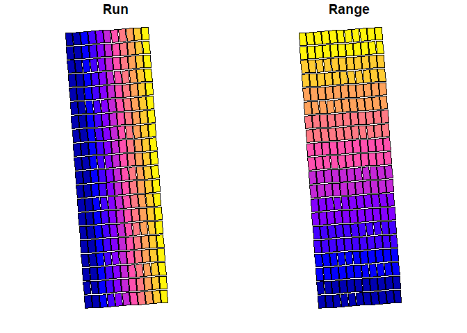

<!-- README.md is generated from README.Rmd. Please edit that file -->

# plotPlotR

<!-- badges: start -->
<!-- badges: end -->

**plotPlotR** referring to plot plotter is a package containing set of
functions to create plot layouts on field trial as segments or
boundaries for the purposes of extracting value from each plot or adding
new data against each plot.

The functions are based on the implementation of “**sf**” package in R
and it provides users with a set of tools that are simple for R users to
create or manipulate plot boundaries. Users who may not be familiar with
spatial data or want functions that can be used easily, repeatedly and
in a automated way can use this package.

Agricultural research and farm management are increasingly becoming
digital. Equipment used in farm operations and data collection are often
connected to the internet, satellites and generates rich meta-data.
These meta-data has the potential to become key research support tools
that generates new opportunity.

**plotPlotR** takes GPS data from the connected devices or manually
collected coordinates from rasters or other sources to develop tools
that supports agricultural research and farm management. Since it is
spatial data we are talking about, the applications of this package
extend beyond agriculture to preserving biodiverstity, land management,
soil conservation etc.

## Installation

You can install the development version of plotPlotR from
[GitHub](https://github.com/AgDataNomad/plotPlotR) with:

``` r
# install.packages("devtools")
devtools::install_github("AgDataNomad/plotPlotR")
```

## Example

This is a basic example which shows you how to create plot boundaries:

``` r
library(plotPlotR)
## A simple function to create plot layout with corner points from a csv file

cornersData # dataframe with 4 XY points corresponding to four corners of an experiment
#>          X         Y id
#> 1 148.6870 -34.47064  1
#> 2 148.6873 -34.47062  4
#> 3 148.6869 -34.46992  2
#> 4 148.6872 -34.46990  3

dat <- read_input_dat(cornersData, 4326, 28355) # Reading data and converting to unit M CRS

dat_plots <- corners_to_plots(dat, 80, 24.2, 11, 20)

dat_plots <- addRunRange(dat_plots, "BL", n_runs = 11, n_ranges = 20)

plot(dat_plots)
```



## Getting started

### Reading data

The function `read_input_dat()` is used to bring your coordinates data
into the plotPlotR environment. `read_input_dat` allows users to input a
csv file path or a dataframe loaded in the `R` environment or any common
shape file formats.

*plotPlotR* requires all shapefiles to have a Coordinate Reference
System (CRS) and more importantly it requires coordinates in unit meters
to compute different functions. Coordinate Reference System is a
coordinates based system to locate geographical entities and is the core
principles of GIS workflows. Most common CRS is WGS84 or EPSG 4326,
which uses longitudes and latitudes to locate geographical entities.
This CRS is what gets used in applications such as navigation systems,
google maps, drone navigation etc. Orthomosaics generated using a
stitching software often has CRS 4326.

When reading data from a CSV file or from a dataframe, users need to
supply the X and Y values using `XY` argument and the CRS using the
`input_CRS` arg. `input_CRS` argument takes any default CRS formats,
just entering the EPSG code as a number works, for example
`input_CRS = 4326`. `XY` argument is not required if and when the csv
file or the dataframe has XY as the first two columns.

Here is an example of reading data using the **cornersData** dataset
included in the package. `read_input_dat` function is used without
declaring `to_CRS_M` argument. NOTE: When `to_CRS_M` is not supplied,
plotPlotR automatically assigns a **WGS 84 / Pseudo-Mercator** CRS.

``` r

dat <- read_input_dat(input_dat = cornersData,
                      input_CRS = 4326)

dat
#> Simple feature collection with 4 features and 1 field
#> Geometry type: POINT
#> Dimension:     XY
#> Bounding box:  xmin: 16551752.3556914 ymin: -4092173.30932014 xmax: 16551789.4505747 ymax: -4092074.50353949
#> Projected CRS: WGS 84 / Pseudo-Mercator
#>   id                       geometry
#> 1  1 POINT (16551761.36137088015...
#> 2  4 POINT (16551789.45057468861...
#> 3  2 POINT (16551752.35569142177...
#> 4  3 POINT (16551780.27652684040...
```

Here is an example of reading data with a `to_CRS_M` agrument.

``` r

dat <- read_input_dat(input_dat = cornersData,
                      input_CRS = 4326,
                      to_CRS_M = 28355)

dat
#> Simple feature collection with 4 features and 1 field
#> Geometry type: POINT
#> Dimension:     XY
#> Bounding box:  xmin: 654928.548113784 ymin: 6184367.6941717 xmax: 654957.872873335 ymax: 6184448.58739261
#> Projected CRS: GDA94 / MGA zone 55
#>   id                       geometry
#> 1  1 POINT (654934.6622248028870...
#> 2  4 POINT (654957.8728733353782...
#> 3  2 POINT (654928.5481137837050...
#> 4  3 POINT (654951.6220567182172...
```

An example of reading data from a dataframe

``` r

dat <- cornersData

class(dat) ##dataframe
#> [1] "data.frame"

df_dat <- read_input_dat(input_dat = dat, input_CRS = 4326)
```

Here is an example of reading input data when the dataframe or the CSV
file doesn’t contain X and Y as the first two columns. `read_input_dat`
function will convert the XY columns to *geometry* and preserves all
other columns.

``` r

dat <- cornersData

#rearranging and renaming columns and adding a new column to demonstrate read_input_dat function

dat <- dat[,c(3,1,2)]

colnames(dat) <- c("A","B","C")

dat$comment <- "some_gps_data"

df_dat <- read_input_dat(input_dat = dat,
                         input_CRS = 4326,
                         XY = c("B", "C"), # columns names of X and Y coordinates
                         to_CRS_M = 28355)

df_dat
#> Simple feature collection with 4 features and 2 fields
#> Geometry type: POINT
#> Dimension:     XY
#> Bounding box:  xmin: 654928.548113784 ymin: 6184367.6941717 xmax: 654957.872873335 ymax: 6184448.58739261
#> Projected CRS: GDA94 / MGA zone 55
#>   A       comment                       geometry
#> 1 1 some_gps_data POINT (654934.6622248028870...
#> 2 4 some_gps_data POINT (654957.8728733353782...
#> 3 2 some_gps_data POINT (654928.5481137837050...
#> 4 3 some_gps_data POINT (654951.6220567182172...
```

### Writing data

Writing outputs of **plotPlotR** is done through calling
`write_output_obj()` function. This function takes two arguments;
`output_dat` and `file_name`. File name is the file path with the
desired extention type. For example *geoJSON*, *kml* etc.

``` r

dat <- read_input_dat(input_dat = cornersData,
                      input_CRS = 4326)

#write_output_obj(dat, "path_to_folder/file_name.geoJSON")
```

## Creating plot layout

Creating plot layout is the core function of the **plotPlotR** package.
Creating plots can be done in one of two ways depending on what
information is available.

1.  From 4 coordinates or sets of 4 coordinates, center of which is the
    center of the experiment. `corners_to_plots` function is used to
    generate plot layouts from the corner points. The corner points can
    be generated using different ways, if you have a raster you can use
    `collect_corners` function to collect corners. Users can use google
    earth, QGIS, Ground Control Points data to get 4 corner points.
2.  From trip points generated from tractors/seeders etc using the
    `make_plots` function. Modern tractors uses GPS or similar systems
    to drive on a paddock to sow seeds etc. These trip points, one for
    each plot can be used to create a field layout.

### Corners to plots

Creating
